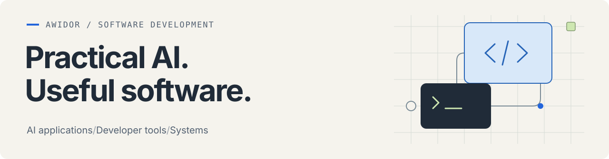

  

I build AI applications, developer tools, and systems software. My projects range from desktop dictation and document search to video inference, coding-agent extensions, and optimization.

I'm interested in the engineering that makes a model useful: connecting it to the right data and tools, fitting it into a usable application, and understanding where it fails.

[Browse public repositories →](https://github.com/awidor?tab=repositories&type=public)

## Selected work

| Project | What it does |
| :--- | :--- |
| **Transcribe** | Desktop dictation with native text insertion, built with Rust and Tauri. |
| **Paperless-AGX** | Document ingestion and search, combining OCR, embeddings, and AI-assisted metadata processing. |
| **RVMMenuBar** | A native macOS camera-preview app running the pretrained [Robust Video Matting](https://github.com/PeterL1n/RobustVideoMatting) model through Core ML. |

## What connects the work

- **Practical AI:** retrieval, model integration, local inference, and human review.
- **Developer tools:** context management, semantic code-search integrations, and workflow automation.
- **Systems and optimization:** native applications, C coursework, and constraint-driven problem solving.

**Languages I work with:** Rust · TypeScript · Python · Swift · C
