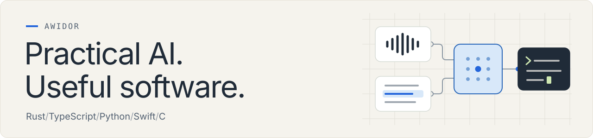
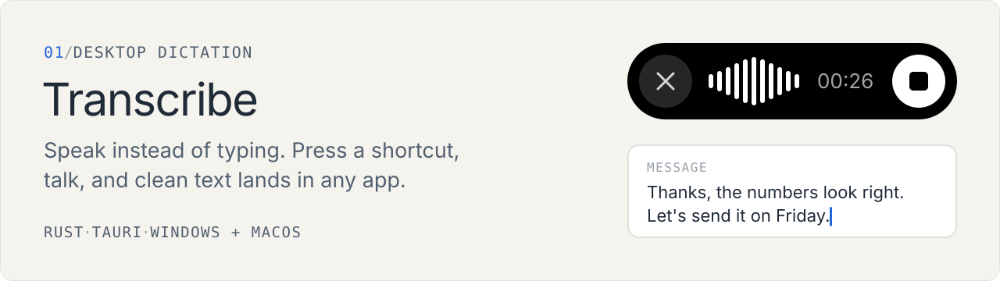
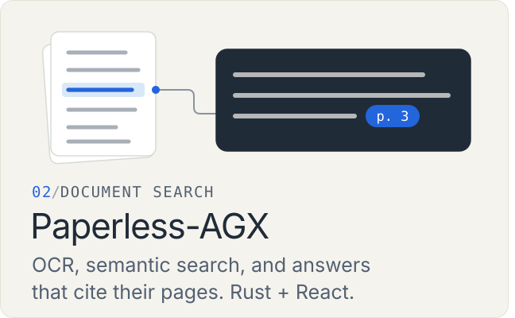
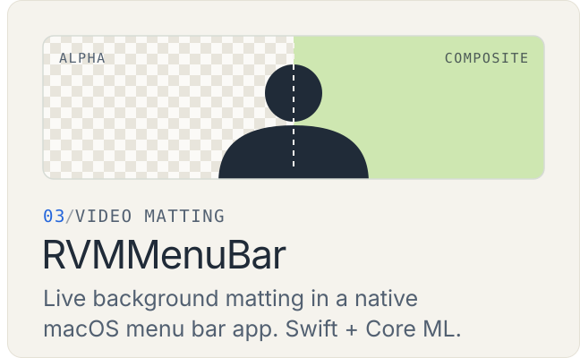

<picture>
  <source media="(prefers-color-scheme: dark)" srcset="./assets/header-dark.svg">
  
</picture>

I'm interested in the engineering that makes a model useful: connecting it to the right data and tools, fitting it into an application people actually use, and understanding where it fails.

<!-- Keep each card on one line: whitespace between or inside the links adds a gap that breaks the two-column row. -->

<a href="https://github.com/awidor/Transcribe"><picture><source media="(prefers-color-scheme: dark)" srcset="./assets/transcribe-dark.svg"></picture></a>
<a href="https://github.com/awidor/paperless-agx"><picture><source media="(prefers-color-scheme: dark)" srcset="./assets/paperless-dark.svg"></picture></a><a href="https://github.com/awidor/RVMMenuBar"><picture><source media="(prefers-color-scheme: dark)" srcset="./assets/rvm-dark.svg"></picture></a>

Also working on, mostly in private: coding-agent extensions, semantic code search, and constraint-driven optimization.
